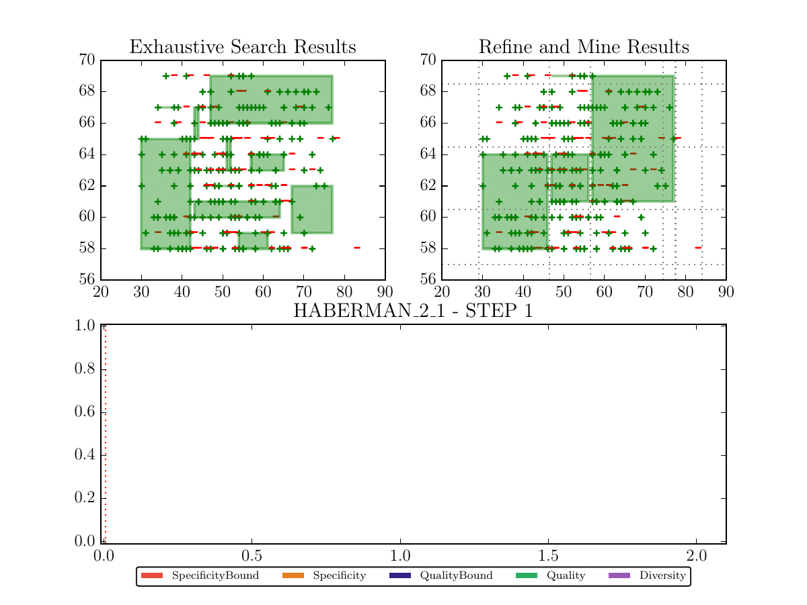

# Anytime Pattern Mining in Numerical Datasets with Guarantees (`RefineAndMine` Code and scripts)


This repository contains the materials concerning the paper : Anytime Interval Patterns Mining with Guarantees. It contains:
1. **RefineAndMine** : The project code.
2. **Datasets**: the datasets used in experiments.
3. **Experiments**: a collection of additional experiments depicting the effectiveness of ___`RefineAndMine`___ as well as the set of scripts used to generate the experiments.
4. **AnimatedFigures**: a set of gif files illustrating the functioning of  ___`RefineAndMine`___ over some UCI datasets.

We give below an illustration of an execution of ___`RefineAndMine`___ over some input dataset depicting how the devised anytime algorithm explore the search space looking for a diversified patterns set. The first figure (left) presents some ground truth computed over the considered datset, the second figure (right) illustrates the returned patterns by ___`RefineAndMine`___ at differents stages of its execution while the third ones report some evaluation measures. Note that, the time is reported in ___seconds___. Below the figure we explain the core idea of ___`RefineAndMine`___, to read the figure keep in mind that: ___`RefineAndMine`___ starts by a discretization (a coarse one) and refines it by adding new cut-points in different dimensions as the time increases. Each gray dotted line corresponds to a new cutpoint added by the method, eventually the approach is able to perform a full traversal of the search space but still (as the example figure shows) the method always provide a solution following the anytime paradigm.   



>___`RefineAndMine`___ is an interruptible anytime pattern mining algorithm which strives to find in interesting regions in labeled numerical datasets that stand out with regards to the property of interest. The principle of functionning of ___`RefineAndMine`___ is intuitive, it starts by considering a coarse __discretization__ which is refined with the increase of the computation time. The devised approach ensure completeness at its termination, but still, it always provide a solution **(** numerical interval patterns that discriminate some studied class/label **)** which improves over time and eventuually converges to the optimal solution if enough time budget is given. An interesting feature is offered by ___`RefineAndMine`___ is its ability to provide provable guarantees that bound: (i) the distance from optimality (best pattern in the search space) (ii) the distance to completeness ensuring a high diversity.

The figure illustrated above presents the behavior of ___`RefineAndMine`___  reporting the evolution of __5__ measures:
 * __Quality__: We report in here the best pattern's quality (informedness) over time. 
 * __QualityBound__: the quality bound, as its name states reports the maximum quality that can be found starting from a timepoint. Hence the difference between the two curves (__Quality__ and __QualityBound__) depicts the accuaracy guarantee of ___`RefineAndMine`___ bounding the distance (error) to the optimal solution.
 * __Specificity__: Evaluates at what extent patterns uncovered in a step of ___`RefineAndMine`___  _(corresponding to a discretization resulting from the refinement of the previous discretization by the addition of a new cutpoint)_ approximates the patterns of the ground truth computed by an exhaustive search algorithm. 
 * __SpecificityBound__: Evaluates at what extent patterns uncovered in a step of ___`RefineAndMine`___ approximates the patterns of the whole search space, thereby reporting how diverse the patterns founds so far by the algorithm.  
 *  __Diversity__: The diversity in here corresponds to how the top-k diverse patterns set returned by ___`RefineAndMine`___ at a certain time approximates some ground truth ( top-k diverse patterns set computed after running an exhaustive search algorithm over the underlying dataset).

## 1.**RefineAndMine** Project Scripts

Contains the scripts of  ___`RefineAndMine`___ and other scripts usefuls to print figures, **./main.py** is the principal script file implementing the approach (Sorry, the code is for now a little bit messy, we will keep this page updated for a python library (model) which can be used to discover descriminant patterns with regards some user-defined quality measure (besides the traditional SD ones )).

> Before being able to use the project, please install Anaconda 4.3.1 for python 2.7 which can be found in the following url : **https://www.continuum.io/DOWNLOADS** and run the project using the conda python interpreter. 

## 2.**Datasets**
| Dataset         	| numerical attributes 	| #rows 	| #intervals                       	| class 	| prevalence 	|
|-----------------	|:--------------------:	|:----:	|---------------------------------	|:-----:	|:----------:	|
| ABALONE\_02\_M  	|           2          	| 4177 	|                      54 401 655 	|   M   	|    0.366   	|
| ABALONE\_03\_M  	|           3          	| 4177 	|                  69 362 110 125 	|   M   	|    0.366   	|
| ABALONE\_04\_M  	|           4          	| 4177 	|         204 535 406 509 260 000 	|   M   	|    0.366   	|
| ABALONE\_05\_M  	|           5          	| 4177 	| 234 572 453 632 178 000 000 000 	|   M   	|    0.366   	|
| AUTOS\_05\_0    	|           5          	|  199 	|              33 448 896 946 080 	|   0   	|    0.322   	|
| AUTOS\_06\_0    	|           6          	|  199 	|         563 145 628 984 202 000 	|   0   	|    0.322   	|
| BREAST\_07\_4   	|           7          	|  683 	|                 373 669 453 125 	|   4   	|    0.350   	|
| BREAST\_08\_4   	|           8          	|  683 	|              16 815 125 390 625 	|   4   	|    0.350   	|
| BREAST\_09\_4   	|           9          	|  683 	|             605 344 514 062 500 	|   4   	|    0.350   	|
| CMC\_04\_1      	|           4          	| 1473 	|                       2 120 580 	|   1   	|    0.427   	|
| CMC\_05\_1      	|           5          	| 1473 	|                       2 120 580 	|   1   	|    0.427   	|
| CMC\_06\_1      	|           6          	| 1473 	|                       2 120 580 	|   1   	|    0.427   	|
| CREDITA\_02\_+  	|           2          	|  666 	|                   1 339 778 520 	|   +   	|    0.449   	|
| CREDITA\_03\_+  	|           3          	|  666 	|              11 408 214 097 800 	|   +   	|    0.449   	|
| CREDITA\_04\_+  	|           4          	|  666 	|           2 886 278 166 743 400 	|   +   	|    0.449   	|
| GLASS\_02\_1    	|           2          	|  214 	|                     157 703 283 	|   1   	|    0.327   	|
| GLASS\_03\_1    	|           3          	|  214 	|                 689 321 049 993 	|   1   	|    0.327   	|
| GLASS\_04\_1    	|           4          	|  214 	|           4 758 383 208 101 670 	|   1   	|    0.327   	|
| HABERMAN\_02\_2 	|           2          	|  306 	|                          77 616 	|   2   	|    0.265   	|
| HABERMAN\_03\_2 	|           3          	|  306 	|                      36 091 440 	|   2   	|    0.265   	|
| SONAR\_03\_R    	|           3          	|  208 	|               4 606 396 474 680 	|   R   	|    0.466   	|
| SONAR\_04\_R    	|           4          	|  208 	|          75 038 198 572 537 200 	|   R   	|    0.466   	|
| SONAR\_05\_R    	|           5          	|  208 	|   1 390 307 743 151 960 000 000 	|   R   	|    0.466   	|

## 3.**Experiments**
The qualitative XP contains a set of experiments and example of scripts that can be used to reproduce performance experiments. Below the scripts corresponding to the questions that we aimed to answer in the paper:
#### 3.1. __Q1__: How does the quality and its bounding measure evolve with time.
The script below produce a csv file having as a name ```<DATASET>_<NB_ATTRS>_<WANTED_LABEL>.csv``` containing information about the quality of the best pattern and its bounding measure at differents timestamps. (The file is updated online with the execution of ___`RefineAndMine`___ leaving the oppurtinity to interrupt the method).
```
python <project_directory>/main.py python --Q1 --dataset <DATASET>  --nbattr <NB_ATTRS> --wanted_label <WANTED_LABEL> --quality_measure <INTERESTINGNESS MEASURE>
```
With :
* ```<DATASET>```: the dataset name to use for experiments, example: CREDITA
* ```_<NB_ATTRS>```: the number of attributes to consider, example: 2
* ```<WANTED_LABEL>```: the wanted label to discriminate, example: +
* ```<INTERESTINGNESS MEASURE>```: The interestingness measure to consider,  available measures for now are: informedness, wracc, and linearCorr (Linear Correlation).

An example of a test is given below:
```
python <project_directory>/main.py  --Q1 --dataset HABERMAN  --nbattr 2 --wanted_label 2 --quality_measure informedness
```

The directory Q1XP contains the experiments reported in CSV files and PDF figures.

#### 3.2. __Q2__: How does the diversity of ___`RefineAndMine`___ evolves with time.

The script below produce a csv file having as a name ```<DATASET>_<NB_ATTRS>_<WANTED_LABEL>_<SIGMA_SUP>_<SIGMA_QUAL>_<TOPK>_<SIGMA_SIM>.csv``` which contains the informations about the diversity, specificity and its bound (if the option ```--compute_crispiness``` is activated) with time.

```
python <project_directory>/main.py  --Q2 --dataset <DATASET>  --nbattr <NB_ATTRS> --wanted_label <WANTED_LABEL> --quality_measure <INTERESTINGNESS MEASURE> --sigma_qual <SIGMA_QUAL> --sigma_sup <SIGMA_SUP> --sigma_sim <SIGMA_SIM> --top_k <TOPK> --compute_crispiness
```

With :
* ```<DATASET>```: the dataset name to use for experiments, example: CREDITA
* ```_<NB_ATTRS>```: the number of attributes to consider, example: 2
* ```<WANTED_LABEL>```: the wanted label to discriminate, example: +
* ```<INTERESTINGNESS MEASURE>```: The interestingness measure to consider,  example: informedness
* ```<SIGMA_SUP>```: positive minimum support threshold, if given in between [0,1], it expresses the minimum TPR that a returned pattern should have, example:0.1.
* ```<SIGMA_QUAL>```: minimum threshold of the quality value, example: 0.2.
* ```<TOPK>```: Number of diverse patterns that should be returned by  ___`RefineAndMine`___, example: 10.
* ```<SIGMA_SIM>```: maximum similarity that is allowed between patterns returned in the top-k list, if ```<SIGMA_SIM>```=0 then the patterns extents in the obtained in the list do not intersect. If ```<SIGMA_SIM>```=1 then the algorithm return the top-k patterns with regards the considered quality measures without filtering the resulting set.
* ```compute_crispiness```: (The name is cool), if activated, the method compute the bound on the specificity, this was made as an option since the specificity bound is optional to the effectiveness of the algorithm, since it does not (for now) the exploration strategy of ___`RefineAndMine`___. However it induces an overhead on the computation, hence it is activated only for performance experiments. 


An example of a test is given below:
```
python <project_directory>/main.py  --Q2 --dataset HABERMAN  --nbattr 2 --wanted_label 2 --quality_measure informedness --sigma_qual 0 --sigma_sup 0.15 --sigma_sim 0.25 --top_k 10 --compute_crispiness
```

The directory Q2XP contains the experiments reported in CSV files and PDF figures.

#### 3.3. __Q3__: How effective is our method against ___`MCTS4DM`___.
We tested ___`RefineAndMine`___ against a recent approach dubbed ___`MCTS4DM`___ that follows the same anytime paradigm relying on MCTS (Monte Carlo Tree Search) devised for pattern mining tasks. For scripts corresponding to MCTS, please refer to their companion page: https://github.com/guillaume-bosc/MCTS4DM .

The directory Q3XP contains the comparative study experiments reported in CSV files and PDF figures.

### 4.**AnimatedFigures**
It contains a set of GIF figures, that we will keep updated reporting the behavior of our method in 2 dimensional datasets. We consider only 2 dimensional datasets in this figures as its easy to read the patterns. 

### Version
1.0.0

### Corresponding Authors
For any questions/remarks, contact BELFODIL Adnene `adnene.belfodil@gmail.com`, BELFODIL Aimene `aimene.belfodil@gmail.com` or Mehdi Kaytoue: mehdi.kaytoue@insa-lyon.fr


